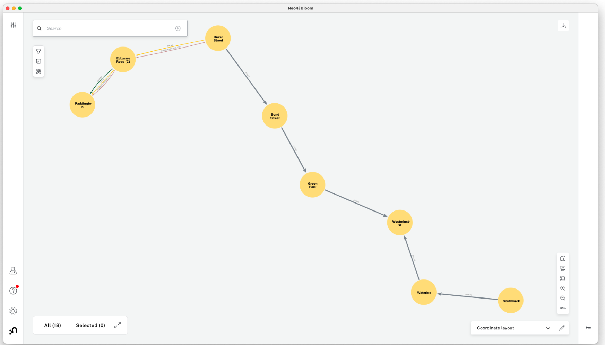

# London Underground Sample Queries

## Shortest path between 2 stations
~~~
MATCH (start:Station {name: "Paddington"})
MATCH (end:Station {name: "Southwark"})
MATCH path = allShortestPaths((start)-[*..99]-(end))
RETURN path
~~~

 
_Example results within the Neo4j Browser_

 
_Example results within the Neo4j Bloom_

## Number of stations per line
### Without APOC

~~~
MATCH (s:Station)-[r]->(t:Station)
WITH type(r) AS line, collect(DISTINCT s.name) + collect(DISTINCT t.name) AS stationNames
UNWIND stationNames AS stationName
WITH line, collect(DISTINCT stationName) AS uniqueStationNames
RETURN line, size(uniqueStationNames) AS numberOfStations
ORDER BY numberOfStations;
~~~

### With APOC

~~~
MATCH (s:Station)-[r]->(t:Station)
WITH type(r) AS line, collect(DISTINCT s) + collect(DISTINCT t) AS stations
RETURN line, size(apoc.coll.toSet(stations)) AS numberOfStations
ORDER BY numberOfStations;
~~~

Here's a breakdown of what this query does:

`MATCH (s:Station)-[r]->(t:Station)` This matches the pattern of station nodes connected by relationships, where s and t are stations and r represents the line relationship.

`WITH type(r) AS line, collect(DISTINCT s) + collect(DISTINCT t) AS stations` This collects all unique station nodes connected by each type of line relationship. It uses `collect(DISTINCT s)` and `collect(DISTINCT t)` to gather the unique stations for both ends of the relationships.

`size(apoc.coll.toSet(stations)) AS numberOfStations` This converts the list of stations to a set to ensure uniqueness and then calculates the size of the set to get the number of unique stations per line.
RETURN line, size(apoc.coll.toSet(stations)) AS numberOfStations: This returns the line and the number of unique stations.

`ORDER BY numberOfStations` This orders the results by the number of stations.

line|numberOfStations|
---|---
WATERLOO_AND_CITY|2
EAST_LONDON|9
VICTORIA|16
BAKERLOO|25
CIRCLE|27
JUBILEE|27
HAMMERSMITH_AND_CITY|28
METROPOLITAN|34
DLR|38
CENTRAL|49
NORTHERN|50
PICCADILLY|52
DISTRICT|60